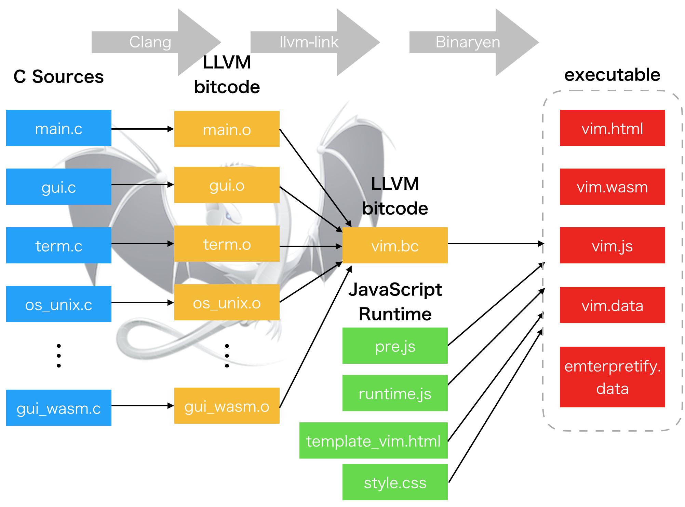
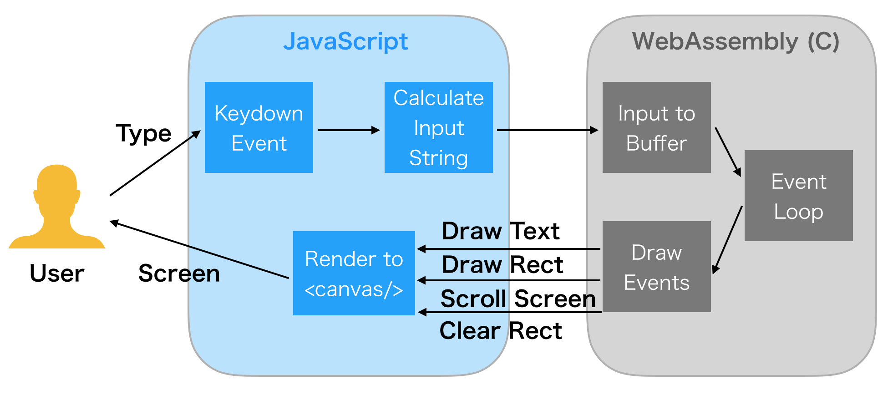

vim.wasm: Vim Ported to WebAssembly
===================================

This project is an experimental fork of [Vim editor][] by [@rhysd][] to compile
it into [WebAssembly][] using [emscripten][] and [binaryen][].

### [Try it with your browser][try it]
- **NOTICES**
  - Please access from a desktop browser (Chrome/Firefox/Safari/Edge). Safari
    seems the best on macOS.
  - Please avoid mobile networks. Your browser will fetch some large files
    (up to 2.5MB).
  - vim.wasm takes key inputs from DOM `keydown` event. Please disable your browser
    extensions which affect key inputs (incognito mode would be the best).
  - This project is very early phase of experiment.  Currently only tiny features
    are supported.  More features will be implemented (please see TODO section).
    And you may notice soon on trying it... it's buggy :)
  - If inputting something does not change anything, please try to click somewhere
    in the page.  Vim may have lost the focus.

The goal of this project is running Vim editor on browser by compiling Vim C
sources into WebAssembly.

[My Japanese Blogpost](https://rhysd.hatenablog.com/entry/2018/07/09/090115)

## How It Works

### Build Process

WebAssembly frontend for Vim is implemented as a new GUI frontend.  C sources are
compiled to each LLVM bitcode files and then they are linked to one bitcode file
`vim.bc` by `emcc`.  `emcc` finally compiles the `vim.bc` into `vim.wasm` binary
using binaryen and generates HTML/JavaScript runtime.

The difference I faced at first was the lack of terminal library such as ncurses.
I modified `configure` script to ignore the terminal library check.  It's OK since
GUI frontend for Wasm is always used instead of CUI frontend. I needed many
workarounds to pass `configure` checks.

emscripten provides Unix-like environment. So `os_unix.c` can support Wasm. However,
some features are not supported by emscripten. I added many `#ifdef FEAT_GUI_WASM`
guards to disable features which cannot be supported by Wasm (i.e. `fork (2)`
support, PTY support, signal handlers are stubbed, ...etc).

I created `gui_wasm.c` heavily referencing `gui_mac.c` and `gui_w32.c`. Event loop
(`gui_mch_update()` and `gui_mch_wait_for_chars()`) is simply implemented with
`sleep()`. And almost all UI rendering events arer passed to JavaScript layer
by calling JavaScript functions from C thanks to emscripten.

C sources are compiled (with many optimizations) into LLVM bitcode with [Clang][]
which is integrated to emscripten. Then all bitcode files (`.o`) are linked to
one bitcode file `vim.bc` with `llvm-link` linker (also integrated to emscripten).

Finally I created JavaScript runtime to draw the rendering events sent from C.
It is created as `wasm/runtime.js` using [emscripten API][emscripten/interacting with codde].
It draws Vim screen to `<canvas/>` element with rendering events such as
'draw text', 'scroll screen', 'set foreground color', 'clear rect', ...etc.

`emcc` (emscripten's C compiler) compiles the `vim.bc` into `vim.wasm`, `vim.js`
and `vim.html` with preloaded Vim runtime files (i.e. colorscheme) using binaryen.
Runtime files are put on a virtual file system provided by emscripten on a browser.

Now hosting `vim.html` with a web server and accessing to it with browser opens
Vim. It works.

#### User Interaction

User interaction is very simple. You input something with keyboard. Browser takes
it as `KeybaordEvent` on `keydown` event and JavaScript runtime sends the input
to Wasm thanks to emscripten's JS to C API. Sent input is added to a buffer in C
layer. It affects the editor's state.

An editor core implemented in C calculates rendering events and sends it to
JavaScript layer thanks to emscripten's C to JS API. JavaScript runtime receives
rendering events and draws them to `<canvas/>` element in the web page.

Finally you can see the rendered results in the page.

## Development

Please make sure that Emscripten and binaryen (I'm using 1.38.6) are installed.
If you use macOS, they can be installed with `brew install emscripten binaryen`.

You can use `build.sh` script to hack this project. Just after cloning this
repository, simply run `./build.sh` and it builds vim.wasm in `wasm/` directory.
It takes time and CPU power a lot.

Finally host the `wasm/` directly on `localhost` with web server such as
`python -m http.server 1234`. Accessing to `localhost:1234/vim.html` will start
Vim with debug build. Note that it's much slower than release build since many
debug features are enabled.

Please note that this repository's `wasm` branch is frequently rebased on the
latest [vim/vim][] master branch. If you want to hack this project, please ensure
to create your own branch and merge `wasm` branch into your branch by `git merge`.

### Known Issues

- WebAssembly nor JavaScript does not provide `sleep()`. By default, emscripten
  compiles `sleep()` into a busy loop.  So vim.wasm is using [Emterpreter][]
  which enables `emscripten_sleep()`. But this feature is not so stable and makes
  built binaries larger and compilation longer.
- JavaScript to C does not fully work with Emterpreter. For example, calling
  some C APIs breaks Emterpreter stack. This also means that calling C functions
  from JavaScript passing a `string` parameter does not work.

## TODO

Development is managed in [GitHub Projects][].

- 'small' (or larger) features support (currently only 'tiny' features are supported)
- Async event loop (to disable Emterpreter)
- Mouse support
- Persistent `.vimrc`
- Packaging vim.wasm as npm package or ES Modules as Web Component
- Save files to local on `:write`

## Special Thanks

This project was heavily inspired by impressive project [vim.js][] by
[Lu Wang][].

## License

All additional files in this repository are licensed under the same license as
Vim (VIM LICENSE).  Please see `:help license` for more detail.

[Vim editor]: https://www.vim.org/
[@rhysd]: https://github.com/rhysd
[WebAssembly]: https://webassembly.org/
[emscripten]: http://kripken.github.io/emscripten-site/
[binaryen]: https://github.com/WebAssembly/binaryen
[try it]: http://rhysd.github.io/vim.wasm
[Clang]: https://clang.llvm.org/
[emscripten/interacting with codde]: https://kripken.github.io/emscripten-site/docs/porting/connecting_cpp_and_javascript/Interacting-with-code.html
[Emterpreter]: https://github.com/kripken/emscripten/wiki/Emterpreter
[GitHub Projects]: https://github.com/rhysd/vim.wasm/projects/2
[vim/vim]: https://github.com/vim/vim
[vim.js]: https://github.com/coolwanglu/vim.js/
[Lu Wang]: https://github.com/coolwanglu

Original README is following.

-------------------------------------------------------------------------------

## What is Vim? ##

Vim is a greatly improved version of the good old UNIX editor Vi.  Many new
features have been added: multi-level undo, syntax highlighting, command line
history, on-line help, spell checking, filename completion, block operations,
script language, etc.  There is also a Graphical User Interface (GUI)
available.  Still, Vi compatibility is maintained, those who have Vi "in the
fingers" will feel at home.  See `runtime/doc/vi_diff.txt` for differences with
Vi.

This editor is very useful for editing programs and other plain text files.
All commands are given with normal keyboard characters, so those who can type
with ten fingers can work very fast.  Additionally, function keys can be
mapped to commands by the user, and the mouse can be used.

Vim runs under MS-Windows (NT, 2000, XP, Vista, 7, 8, 10), Macintosh, VMS and
almost all flavours of UNIX.  Porting to other systems should not be very
difficult.  Older versions of Vim run on MS-DOS, MS-Windows 95/98/Me, Amiga
DOS, Atari MiNT, BeOS, RISC OS and OS/2.  These are no longer maintained.

## Distribution ##

You can often use your favorite package manager to install Vim.  On Mac and
Linux a small version of Vim is pre-installed, you still need to install Vim
if you want more features.

There are separate distributions for Unix, PC, Amiga and some other systems.
This `README.md` file comes with the runtime archive.  It includes the
documentation, syntax files and other files that are used at runtime.  To run
Vim you must get either one of the binary archives or a source archive.
Which one you need depends on the system you want to run it on and whether you
want or must compile it yourself.  Check http://www.vim.org/download.php for
an overview of currently available distributions.

Some popular places to get the latest Vim:
* Check out the git repository from [github](https://github.com/vim/vim).
* Get the source code as an [archive](https://github.com/vim/vim/releases).
* Get a Windows executable from the
[vim-win32-installer](https://github.com/vim/vim-win32-installer/releases) repository.

## Compiling ##

If you obtained a binary distribution you don't need to compile Vim.  If you
obtained a source distribution, all the stuff for compiling Vim is in the
`src` directory.  See `src/INSTALL` for instructions.

## Installation ##

See one of these files for system-specific instructions.  Either in the
READMEdir directory (in the repository) or the top directory (if you unpack an
archive):

	README_ami.txt		Amiga
	README_unix.txt		Unix
	README_dos.txt		MS-DOS and MS-Windows
	README_mac.txt		Macintosh
	README_vms.txt		VMS

There are other `README_*.txt` files, depending on the distribution you used.

## Documentation ##

The Vim tutor is a one hour training course for beginners.  Often it can be
started as `vimtutor`.  See `:help tutor` for more information.

The best is to use `:help` in Vim.  If you don't have an executable yet, read
`runtime/doc/help.txt`.  It contains pointers to the other documentation
files.  The User Manual reads like a book and is recommended to learn to use
Vim.  See `:help user-manual`.

## Copying ##

Vim is Charityware.  You can use and copy it as much as you like, but you are
encouraged to make a donation to help orphans in Uganda.  Please read the file
`runtime/doc/uganda.txt` for details (do `:help uganda` inside Vim).

Summary of the license: There are no restrictions on using or distributing an
unmodified copy of Vim.  Parts of Vim may also be distributed, but the license
text must always be included.  For modified versions a few restrictions apply.
The license is GPL compatible, you may compile Vim with GPL libraries and
distribute it.

## Sponsoring ##

Fixing bugs and adding new features takes a lot of time and effort.  To show
your appreciation for the work and motivate Bram and others to continue
working on Vim please send a donation.

Since Bram is back to a paid job the money will now be used to help children
in Uganda.  See `runtime/doc/uganda.txt`.  But at the same time donations
increase Bram's motivation to keep working on Vim!

For the most recent information about sponsoring look on the Vim web site:
	http://www.vim.org/sponsor/

## Contributing ##

If you would like to help making Vim better, see the [CONTRIBUTING.md](https://github.com/vim/vim/blob/master/CONTRIBUTING.md) file.

## Information ##

The latest news about Vim can be found on the Vim home page:
	http://www.vim.org/

If you have problems, have a look at the Vim documentation or tips:
	http://www.vim.org/docs.php
	http://vim.wikia.com/wiki/Vim_Tips_Wiki

If you still have problems or any other questions, use one of the mailing
lists to discuss them with Vim users and developers:
	http://www.vim.org/maillist.php

If nothing else works, report bugs directly:
	Bram Moolenaar <Bram@vim.org>

## Main author ##

Send any other comments, patches, flowers and suggestions to:
	Bram Moolenaar <Bram@vim.org>

This is `README.md` for version 8.1 of Vim: Vi IMproved.
