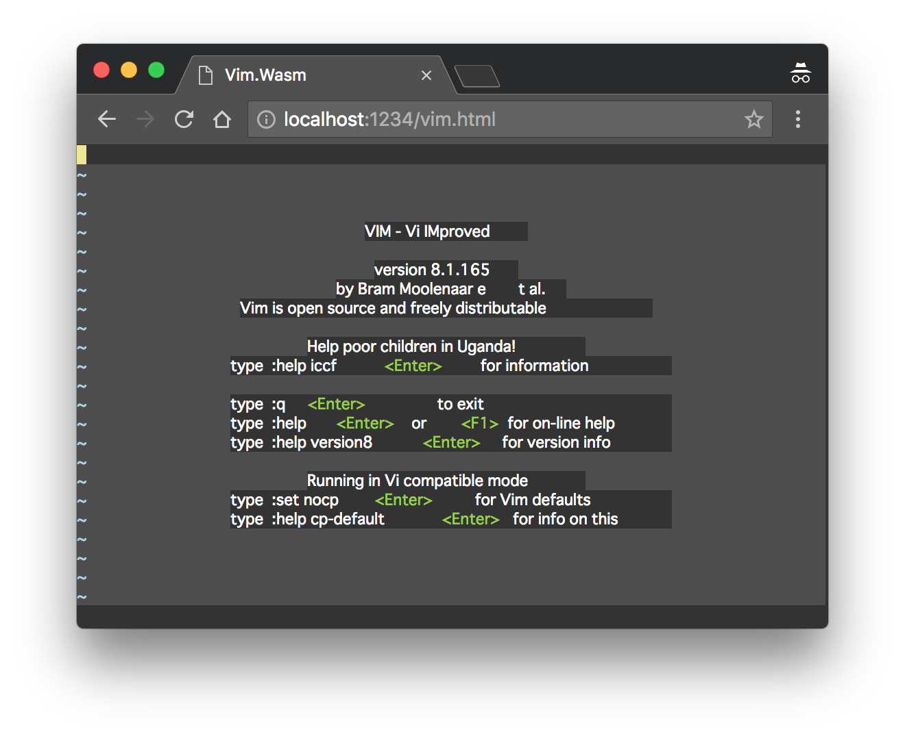

Usage of [Live Demo][demo]
==========================

This documentation describes how to use [live demo][demo]. For the usage of npm package, please read
[README.md](./README.md).

[Live demo][demo] runs 'normal' feature Vim. It supports almost all Vim's powerful features (syntax
highlighting, Vim script, text objects, ...) including the latest features (popup window, ...)



When opening it, it opens `tryit.js` example JavaScript source code. Basic usage is described in
comments at top of the file. Example source contains min-heap data structure and heap sort algorithm.
Enjoy coding! And `:%` runs the code in your browser.

## Try 'small' Feature Set

By default [live demo][demo] runs Vim with normal feature set. It provides almost all Vim's powerful
features but its binary size is big.

As alternative, `vim-wasm` package also provides Vim with small feature set. It provides only basic
features but its binary size is much smaller.

Giving `feature=small` query parameter switches Vim to small feature set. Please check what feature is not
provided and how small the binary size is.

https://rhysd.github.io/vim.wasm/?feature=small

## Evaluate JavaScript Files

`:!` command can run shell commands in Vim. Since there is no shell command in WebAssembly world, the
command is basically not available. However, only JavaScript files are executable.
Since `%` is a special character indicating the current buffer in Vim's command line, `:!%` runs the
current buffer.

**Example:** Evaluates `/path/to/source.js`

```vim
:!/path/to/source.js
```

**Example:** Evaluates the current buffer

```vim
:!%
```

## Set Font with `guifont` Option

`guifont` option is available like other GUI Vim. All font names available in CSS are also available here.
Note that **only monospace fonts are considered**. If you specify other font like `serif`, junks may remain
on re-rendering a screen. If you want to specify font height also, `:h{pixels}` suffix is available.

**Example:** Set 'Monaco' font

```vim
:set guifont=Monaco
```

**Example:** Set 'Monaco' font with 20 pixels height

```vim
:set guifont=Monaco:h20
```

## Passing Program Arguments

`arg` query parameters are passed to Vim command arguments. For example, passing `-c 'split ~/source.c'`
to Vim can be done with query parameters `?arg=-c&arg=split%20~%2fsource.c` (`%20` is white space and
`%2f` is slash). `arg` can be specified multiple times. One `arg=` query parameter is corresponding
to one argument. This parameter is useful when you want to open some file by default.

**Example:** Executes `:set number` at Vim starting

https://rhysd.github.io/vim.wasm/?arg=-c&arg=set%20number

**Example:** Outputs the version information in DevTools console and immediately quits Vim

https://rhysd.github.io/vim.wasm/?arg=--version

## Check Debug Logging

By adding `debug` query parameter, debug logs are output in DevTools console from both main thread
and worker thread. Note that debug log from C is not output. To enable it, you need to build `vim.wasm`
binary with debug build because debug log is controlled by `GUI_WASM_DEBUG` preprocessor macro.

**Example:**

https://rhysd.github.io/vim.wasm/?debug

## Enable Performance Tracing

By adding `perf` query parameter, it enables performance tracing. After editing some texts or using some
feature in Vim, please quit Vim with `:quit`. Then performance tracing results are output in DevTools
console. Note that please avoid using both `debug` and `perf` query parameters at the same time. Debug
log output slows Vim.

**Example:**

https://rhysd.github.io/vim.wasm/?perf

**Note:** 'Vim exits with status N' dialog does not show up not to prevent performance measurements.

[demo]: https://rhysd.github.io/vim.wasm
